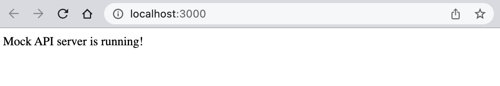

# Mock API

A simple mock API server for testing purposes.



## Get started

Start the mock API by typing this into your terminal:

```zsh
npm start
```

To terminate the mock API server, press `Ctrl + C` in your terminal.

## Usage

### Mock endpoint

You can make HTTP POST requests with arbitrary JSON payloads:

+   to the `/mock` endpoint (at `http://localhost:3000/mock`), and
+   to the `/mock/echo` endpoint (at `http://localhost:3000/mock`).

Nothing will happen with the JSON payload you submit, because the mock API server is not designed 
to do anything with your request.

For example, you can send the following HTTP POST request to the `/mock` endpoint:

```JSON
{
    "text": "hello world"
}
```

Regardless of the payload you send, if your request is successful, you should received a HTTP 
response with the following text:

```zsh
Mock request successful!
```

## Debugging

If you're API server is running correctly, you should see a similar output in your terminal:

```zsh
> apitest@1.0.0 start
> nodemon app.js

[nodemon] 2.0.22
[nodemon] to restart at any time, enter `rs`
[nodemon] watching path(s): *.*
[nodemon] watching extensions: js,mjs,json
[nodemon] starting `node app.js`
Server is up and running at http://localhost:3000 ...
```

If you are not sure the mock API server is running, you can check by:

1.  opening your browser at `http://localhost:3000`
2.  typing `curl http://localhost:3000` in your terminal, or
3.  sending an empty HTTP GET request to `http://localhost:3000` from your preferred API tool 
    (e.g. Postman)

You will know your server is running correctly if you see the following message:

```zsh
Mock API server is running!
```

If you are confused about what `nodemon` is, don't worry. `nodemon` is a tool that helps develop 
node.js based applications by automatically restarting the node application when file changes in 
the directory are detected. This simply means that you don't have to restart the mock API server
every time you make a change to the code. Every time you save a change to the code, `nodemon` will
automatically restart the mock API server for you so that you can see the changes you made.