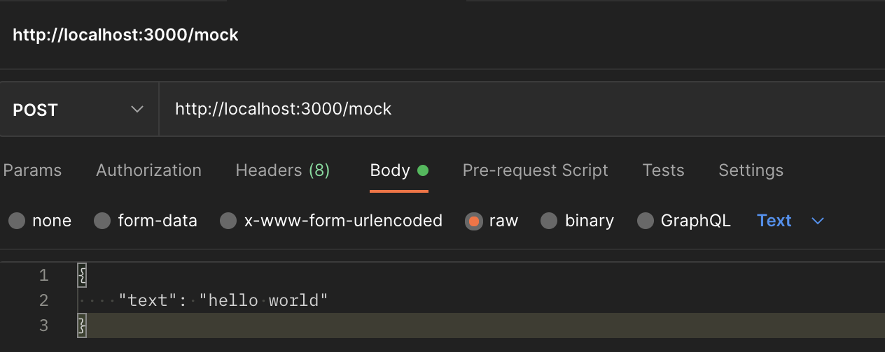
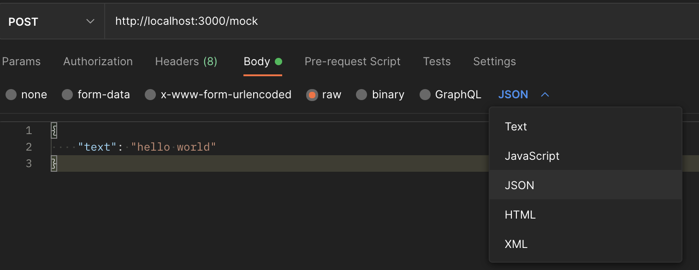

# Other notes

Create new directory

```zsd
mkdir apiptest
cd apitest
npm init
code .
```

Add `.gitignore` file

```ini
# Source: gitignore/Node.gitignore 
# Link: https://github.com/github/gitignore/blob/main/Node.gitignore

# Dependency directories
node_modules/

# Environments
.env

# VS Code specific
.vscode

# Mac specific
.DS_Store
```


Install MVP dependencies

```zsh
npm install express
npm install nodemon 
npm install body-parser
```

+   [`body-parser`][npm body-parser], which provides the application 
    with functionality to parse HTTP responses.
+   [`express`][npm express], which provides the application with the 
    necessary web server functionality.
+   [`nodemon`][npm nodemon], which helps restart the Node.js application 
    every time a relevant change occurs to simplify the development of the app locally.


To make use of the functionality in the `nodemon` library, I updated the `package.json` file as follows:

```json
"scripts": {
  "start":"nodemon app.js"
}
```

Using JSDoc decorator 

Source: [jsdoc.app @use JSDoc][jdoc @description]

```js
/**
 * @param {number} a
 * @param {number} b
 * @returns {number}
 * @description Add two numbers.
 */
function add(a, b) {
    return a + b;
}
```

Create `app.js` file and start wih minimal imports

```js
// Imports libraries

// Provides the application with the necessary web server functionality.
const express = require('express')

// Restarts Node.js application every time a relevant change occurs to simplify local development.
const { restart } = require('nodemon')

// Provides the application with functionality to parse HTTP responses.
const bodyParser = require('body-parser') 
```

Currently request fails in Postman with `400 Bad request` error 
"The request cannot be fulfilled due to bad syntax."

Endpoint: http://localhost:3000/webhooks/


Body:

```json
{
    "text": "hello world",
    "date": "Wed, May 31"
}
```

Response

```json
{
    "message": {}
}
```

Changing to `GET` works 

Endpoint: http://localhost:3000/webhooks

Response:

```txt
Success
```

## `console.log` is not printing the request body as expected

```js
router.post('/', async(req,res) => {
    try {
        console.log(`New request with body: ${req.body}`);
        ...
```

Console shows:

```zsh
Server is up and running at http://localhost:3000 ...
New request with body: [object Object]
```

Check: Console logging some arbitrary JSON should work. 

Tested in node:

```zsh
~/Documents/apitest main $ node
Welcome to Node.js v18.3.0.
Type ".help" for more information.
> console.log({"text": "hello"})
{ text: 'hello' }
```

Problem 1: I formatted request body as raw > text and not raw > JSON in Postman.





Success with 

```js
router.post('/', async(req,res) => {
    try {
        console.log(`New request with body:`);
        console.log(req.body);
        ...
```

```zsh
New request with body:
{ text: 'hello world' }
```

Problem 2: console logging request with dollar sign notation `${...}` doesn't work


<!-- Hyperlinks -->

[jdoc @description]: https://jsdoc.app/tags-description.html
[npm body-parser]: https://www.npmjs.com/package/body-parser
[npm express]: https://www.npmjs.com/package/express
[npm nodemon]: https://www.npmjs.com/package/nodemon